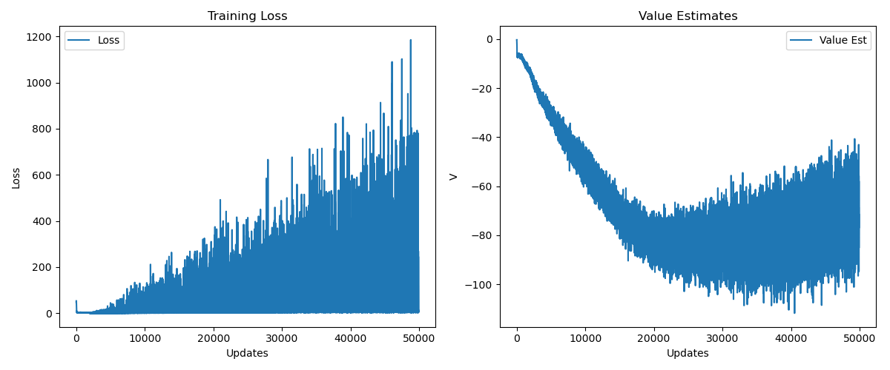
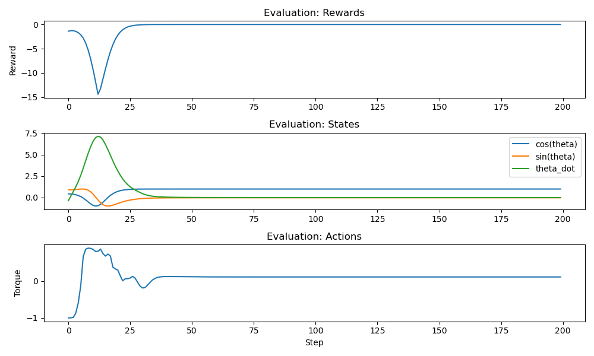
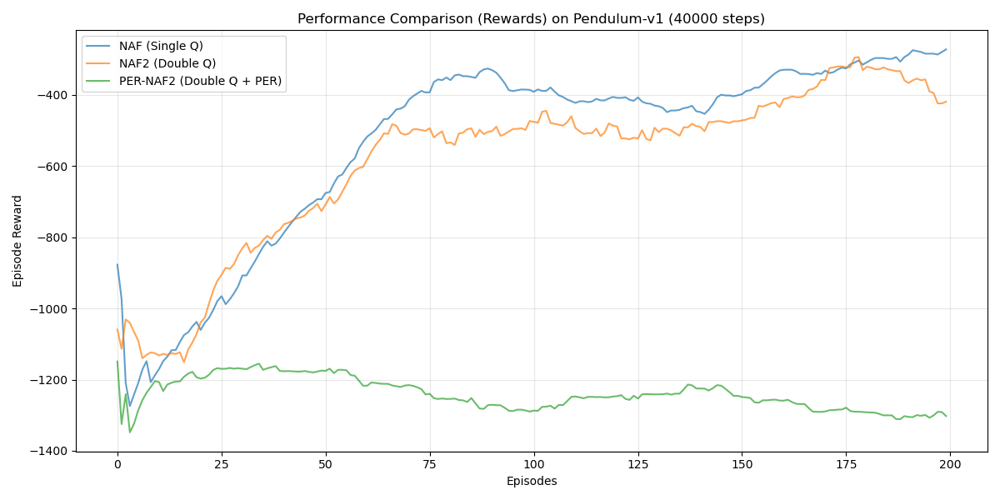

# PER-NAF

An implementation of the Normalized Advantage Function Reinforcement Learning Algorithm with Prioritized Experience Replay

## Summary

* The original paper of this code is: <https://arxiv.org/abs/1603.00748>
* The code is mainly based on: <https://github.com/carpedm20/NAF-tensorflow/>
* Additionally I added the prioritized experience replay: <https://arxiv.org/abs/1511.05952>
* Using the OpenAI baseline implementation: <https://github.com/openai/baselines/blob/master/baselines/deepq/replay_buffer.py>

Thanks openAI and Kim!

## Some Advices from experience in RL

* Normalize the state and action space as well as the reward is a good practice
* Visualise as much as possible to get an intuition about the method as possible bugs
* If it does not make sense it is a bug with very high probability

## Installation

1. Clone the repository:

    ```bash
    git clone <repository_url>
    cd PER-NAF
    ```

2. Install dependencies:

    ```bash
    pip install -r requirements.txt
    ```

3. Install the package in editable mode:

    ```bash
    pip install -e pernaf
    ```

## Benchmarks

The project has been fully migrated to **PyTorch**.
The project includes benchmark scripts to verify the NAF agent's performance on standard Gymnasium environments.

### Pendulum-v1

Trains the NAF agent on the continuous Pendulum task.

```bash
python train_pendulum_benchmark.py
```

Results (plots and stats) will be saved to the `results/` directory.

### Results

After running the benchmarks, check `results/` for training curves and evaluation plots.

#### training stats



#### evaluation plot



### Algorithm Comparison

We compared three variants of the NAF agent on `Pendulum-v1` (40k steps).
The plot below shows the **Episode Reward** (Moving Average):

1. **NAF (Baseline)**: Standard NAF with Single Q-Learning.
2. **NAF2 (Double Q)**: NAF with Double Q-Learning.
3. **PER-NAF2**: Double Q-Learning + Prioritized Experience Replay.



## Usage

To run the main training loop:

```bash
python naf2.py
```

## Structure

* `naf2.py`: Main entry point for training NAF agents.
* `simulated_environment_final.py`: Simulated environment for the agent (AWAKE electron beam).
* `pernaf/`: core package containing Algorithm implementation (PER-NAF).
